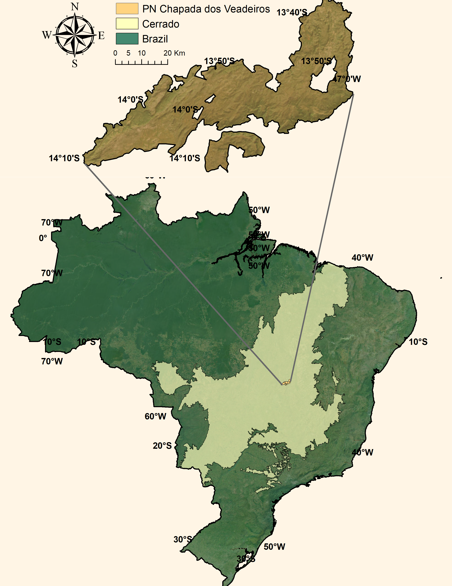

```{r, include=FALSE}
knitr::opts_chunk$set(results = 'asis',
                      echo = FALSE,
                      warning = FALSE,
                      tidy = FALSE,
                      message = FALSE,
                      fig.align = 'center',
                      out.width = "100%")
options(knitr.table.format = "html") 
```

```{r myplot, include=FALSE}

```


```{r, include=FALSE}
knitr::write_bib(c('posterdown', 'rmarkdown','pagedown'), 'packages.bib')
```

# Introduction
Campos de Murundus, or earthmounds, are discrete mounds surrounded by grass common throughout the Brazilian Savanna. Such sites favor colonization both by plants and by termites¹, which play a major role in ecosystem dynamics and maintenance through organic matter decomposition and greenhouse gases fluxes².

```{r murundus, echo=FALSE, fig.cap="Campos de Murundus in the National Park Chapada dos Veadeiros", out.width = '100%'}
knitr::include_graphics("Yuri_Souza_PSI_poster_files/figure-html/murundus.png")
```

# Objectives
My goal is to address how *Campos de murundus* drive ecosystem dynamics in a spatial gradient by investigating the following:

**1.** What are tiny terrestrial islands' roles in ecosystem dynamics?

**2.** Do termite species composition, and diversity vary within and outside the Murundus?

**3.** How does the Murundus drive soil structure, nutrient composition, and gas fluxes?

**4.** Are the changes in soil affecting plants' functional diversity?

**5.** Can vertebrates change the Murundus dynamic through predation and physical damage?

# Methods

This experiment will be performed by a literature review and data collection in the Brazilian Savanna **Cerrado**. Our sample design consists of termites, plants, and soil sample collections in a spatial gradient into and around the conserved and damaged Murundus. 

```{r pncv, echo=FALSE, fig.cap="National Park Chapada dos Veadeiros", out.width = '100%'}

```

# Hypothesis

We hypothesize the existence of a gradient of termite diversity, soil nutrient enrichment, plant functional composition, and gas fluxes increasing from an open grass field of the Savanna to the Murundus. Such gradient might be affected by the conserved state of the Murundus. Thus, we expect the Murundus to be tiny ecological islands for species composition and ecosystem processes such as gas emission and nutrient turnover.

# References

**1.** Oliveira-Filho, A. T. (1992). *Journal of Tropical Ecology* 

**2.** Zanne, A. E., et al. (2022). *Science* 

**3.** de Souza, H. J., & Delabie, J. H. C. (2016). *Annales de la Société entomologique de France*
